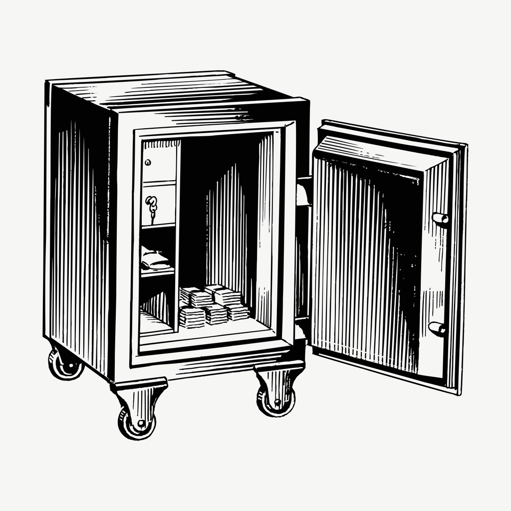

# `clerk-vault`
🧑‍💼 Vault | Clerk 🧑‍💼

## ©️ Copyright
- "<a rel="noopener noreferrer" href="https://www.rawpixel.com/image/6516161/image-vintage-public-domain-money">Money stored safe drawing, vintage</a>" is marked with <a rel="noopener noreferrer" href="https://creativecommons.org/publicdomain/zero/1.0/?ref=openverse">CC0 1.0 </a>.

## :scroll: License

The license for the code and documentation can be found in the [LICENSE](./LICENSE) file.

---

Made in Québec 🏴󠁣󠁡󠁱󠁣󠁿, Canada 🇨🇦!
